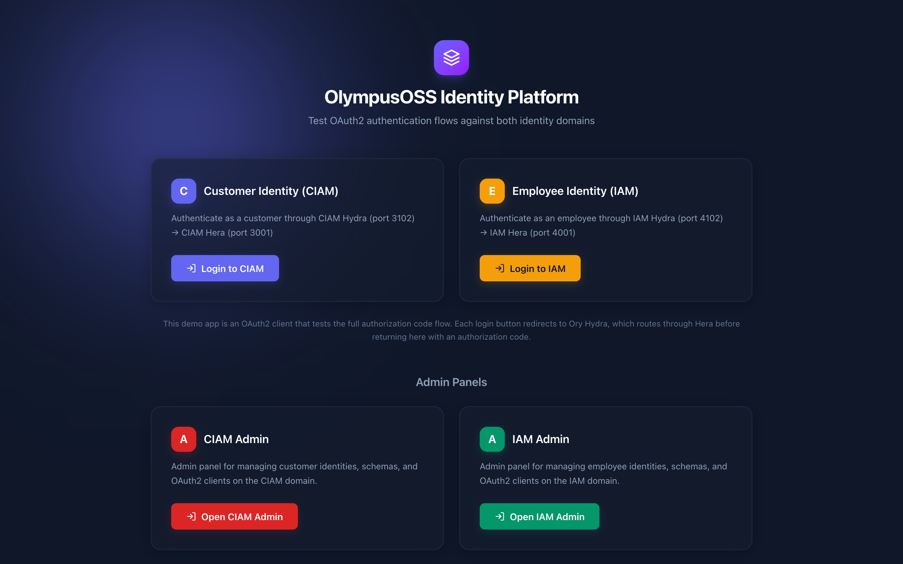

# Site

Brochure site and OAuth2 playground for the [OlympusOSS Identity Platform](https://github.com/OlympusOSS/platform).

Built with Next.js, TypeScript, and the [Canvas](https://github.com/OlympusOSS/canvas) design system.

---

## Screenshot



---

## What It Does

The main site for OlympusOSS — showcases the platform with a brochure landing page and includes a working OAuth2 playground that demonstrates the full Authorization Code flow against Ory Hydra.

- **Brochure** — Hero, features, architecture diagram, and getting started guide
- **OAuth2 Playground** — Log in as a customer (CIAM) or employee (IAM) and inspect tokens
- **Token inspection** — View decoded ID token claims, access token, scopes

---

## Prerequisites

- An [Ory Hydra](https://www.ory.sh/hydra/) instance with registered OAuth2 clients
- A [Hera](https://github.com/OlympusOSS/hera) instance for authentication + consent

---

## Environment Variables

| Variable | Description | Default |
|----------|-------------|---------|
| `NEXT_PUBLIC_CIAM_HYDRA_URL` | CIAM Hydra public URL | `http://localhost:3102` |
| `NEXT_PUBLIC_IAM_HYDRA_URL` | IAM Hydra public URL | `http://localhost:4102` |
| `CIAM_CLIENT_ID` | CIAM OAuth2 client ID | `site-ciam-client` |
| `CIAM_CLIENT_SECRET` | CIAM OAuth2 client secret | `site-ciam-secret` |
| `IAM_CLIENT_ID` | IAM OAuth2 client ID | `site-iam-client` |
| `IAM_CLIENT_SECRET` | IAM OAuth2 client secret | `site-iam-secret` |
| `NEXT_PUBLIC_APP_URL` | Site base URL (used for redirect URIs) | `http://localhost:2000` |

---

## Getting Started

Site is part of the [OlympusOSS Identity Platform](https://github.com/OlympusOSS/platform). All repos must be cloned as siblings under a shared workspace:

```
Olympus/
├── platform/    # Infrastructure & Podman Compose — start here
├── athena/      # Admin dashboard
├── hera/        # Auth & consent UI
├── site/        # Brochure site & OAuth2 playground (this repo)
├── canvas/      # Design system
└── octl/        # Deployment CLI
```

### Start the development environment

```bash
octl dev
```

The CLI installs Podman (if needed), starts all containers, and seeds test data. Once complete, open:

- **Site** — [http://localhost:2000](http://localhost:2000)

Site is volume-mounted into Podman for **live reload** — edit files locally and changes reflect immediately.

### Standalone (without platform)

```bash
bun install
bun run dev
```

Open [http://localhost:2000](http://localhost:2000). Requires Hydra and Hera running separately with registered OAuth2 clients.

---

## Routes

| Route | Purpose |
|-------|---------|
| `/` | Landing page — brochure + OAuth2 playground |
| `/callback/ciam` | CIAM OAuth2 callback — exchanges code for tokens |
| `/callback/iam` | IAM OAuth2 callback — exchanges code for tokens |
| `/logout/ciam` | CIAM logout — clears session cookie |
| `/logout/iam` | IAM logout — clears session cookie |
| `/health` | Health check endpoint |

---

## Tech Stack

| Category | Technology |
|----------|-----------|
| Framework | Next.js 15, React 19 |
| Language | TypeScript |
| Runtime | [Bun](https://bun.sh/) |
| Design System | [@olympusoss/canvas](https://github.com/OlympusOSS/canvas) |
| Styling | Tailwind CSS |
| Animations | Framer Motion |

---

## Project Structure

```
src/
├── app/
│   ├── page.tsx            # Landing page (brochure sections + playground)
│   ├── callback/
│   │   ├── ciam/route.ts   # CIAM token exchange
│   │   └── iam/route.ts    # IAM token exchange
│   ├── logout/
│   │   ├── ciam/route.ts   # CIAM session clear
│   │   └── iam/route.ts    # IAM session clear
│   └── health/route.ts     # Health check
├── components/
│   ├── nav-bar.tsx          # Sticky navigation
│   ├── hero-section.tsx     # Hero with logo + CTAs
│   ├── features-section.tsx # Feature card grid
│   ├── architecture-section.tsx # Visual architecture diagram
│   ├── getting-started-section.tsx # Quick start guide
│   ├── playground-section.tsx # OAuth2 playground
│   └── footer.tsx           # Site footer
└── styles/
    └── globals.css          # Canvas tokens + Tailwind
```

---

## License

MIT
