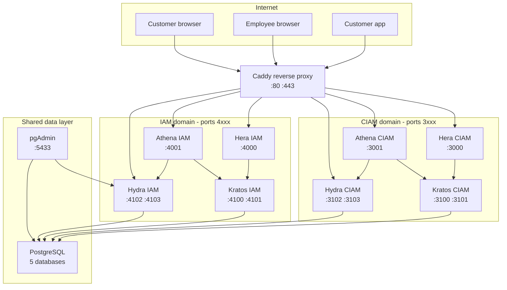

Olympus uses a **dual-domain architecture** that cleanly separates customer-facing identity (CIAM) from internal employee identity (IAM). Each domain is a fully independent Kratos + Hydra + Athena + Hera stack with its own database namespace and its own configuration.

## Top-level layout



## Why two domains?

A single-domain architecture (one Kratos + one Hydra serving both customers and employees) is simpler. Olympus chooses the more complex shape on purpose:

- **Security isolation.** A compromise of the customer-facing identity surface does not touch the employee one. SQL injection, credential stuffing, account-takeover — none of these crossing the boundary.
- **Independent policies.** Customers and employees have different password rules, different session lifetimes, different MFA requirements, and different identity schemas. Trying to satisfy both with one Kratos config is awkward; running two Kratoses is straightforward.
- **Clean data boundaries.** PII for customers and credentials for employees live in different databases, simplifying GDPR DSR, retention policies, and backups.
- **Independent scaling.** A customer-traffic spike does not consume employee-domain database capacity.
- **Independent upgrades.** The CIAM Kratos can be upgraded ahead of (or behind) the IAM Kratos.

See ADR [0001 — Dual-Domain Architecture](/docs/adrs/0001-dual-domain-architecture) for the full decision record.

## Port layout

```
CIAM (customer identity) — ports 3xxx
├── Hera CIAM (login/consent UI)      → :3000
├── Athena CIAM (admin dashboard)     → :3001
├── Kratos CIAM (identity service)    → :3100 (public) / :3101 (admin)
└── Hydra CIAM (OAuth2 provider)      → :3102 (public) / :3103 (admin)

IAM (employee identity) — ports 4xxx
├── Hera IAM (login/consent UI)       → :4000
├── Athena IAM (admin dashboard)      → :4001
├── Kratos IAM (identity service)     → :4100 (public) / :4101 (admin)
└── Hydra IAM (OAuth2 provider)       → :4102 (public) / :4103 (admin)

Shared services
├── Site (brochure + playground + docs) → :2000
├── PostgreSQL                          → :5432
├── pgAdmin (SSO via IAM)               → :5433
└── MailSlurper (dev only)              → :5434
```

In production, **only ports 80 and 443 should be public.** All admin APIs (`:3101`, `:3103`, `:4101`, `:4103`, `:5432`) must be firewalled — see [Operate — Network Topology](/docs/operate/network-topology) for the host firewall ruleset.

## Core services

### Ory Kratos — identity management

Handles the full user lifecycle: registration, login, account recovery, email verification, and profile management. Each domain has its own Kratos instance with an independent JSON-Schema identity model.

- Public API (browser-facing flows): `:3100` (CIAM) / `:4100` (IAM)
- Admin API (server-side identity management): `:3101` (CIAM) / `:4101` (IAM)
- Identity schemas: see [Identity — Schemas](/docs/identity/identity-schemas)

### Ory Hydra — OAuth2 / OIDC

Standards-compliant OAuth2 and OpenID Connect provider. Supports Authorization Code with PKCE (mandatory for public clients — see [Security — PKCE Enforcement](/docs/security/pkce-enforcement)), client credentials, OIDC discovery, and RP-initiated logout.

- Public API (token endpoints, discovery, JWKS): `:3102` / `:4102`
- Admin API (client and consent management): `:3103` / `:4103`

### Athena — admin dashboard

Web-based admin panel for managing identities, sessions, OAuth2 clients, tokens, courier messages, schemas, and settings. One instance per domain — though most operators only access the IAM Athena, since it can in turn manage the CIAM Kratos/Hydra via the same admin APIs.

See [Internals — Athena](/docs/internals/athena-route-map) for the full surface.

### Hera — login UI

Renders Kratos self-service flows (login, registration, recovery, verification, settings) and Hydra consent screens (login challenge, consent challenge, logout challenge). Implements the breached-password check, account-lockout policy, and PKCE analytics.

### Caddy — ingress

The single public entry point. Terminates TLS, applies rate limiting via the [`caddy-ratelimit`](https://github.com/mholt/caddy-ratelimit) module, sets security headers, and reverse-proxies to the appropriate backend. See [Security — Caddy Supply Chain](/docs/security/caddy-supply-chain) for the reproducible build process.

### SDK — shared library

Imported by Athena, Hera, and Site. Provides:
- Settings vault (key/value in the `olympus` database)
- AES-256-GCM encryption with HKDF-SHA256 key derivation
- Brute-force protection and lockout tracking
- Session location tracking
- TTL cache for hot settings reads

See [Reference — SDK Settings API](/docs/reference/api-sdk-settings).

## Data layer

All persistent state lives in PostgreSQL across **five databases**:

| Database | Owned by | Purpose |
| --- | --- | --- |
| `ciam_kratos` | CIAM Kratos | Customer identities, sessions, recovery tokens, courier messages |
| `ciam_hydra` | CIAM Hydra | Customer OAuth2 clients, tokens, consent sessions, JWKs |
| `iam_kratos` | IAM Kratos | Employee identities, sessions, recovery tokens, courier messages |
| `iam_hydra` | IAM Hydra | Employee OAuth2 clients, tokens, consent sessions, JWKs |
| `olympus` | SDK (used by Athena, Hera, Site) | Settings, locations, login attempts, lockouts, security audit log |

All connections use `sslmode=verify-full` in production — see [Deploy — Database SSL verify-full](/docs/deploy/database-ssl-verify-full).

## Dev versus prod

The Compose stack has two variants:

- **`platform/dev/compose.dev.yml`** — local development. App repos (athena, hera, site) are mounted as volumes for live reload. MailSlurper captures outbound email. Captcha is disabled. TLS is a self-signed cert managed by Caddy on `localhost.olympus.app`.
- **`platform/prod/compose.prod.yml`** — production. Apps come from `ghcr.io/olympusoss/*` pinned by digest. Email goes through a real provider (Resend, Postmark, Brevo, SMTP2GO, or custom SMTP). Captcha is enabled if `TURNSTILE_*` is configured. TLS is real, issued by Let's Encrypt.

See [Deploy — Dev vs Prod](/docs/deploy/dev-vs-prod) for the field-by-field comparison.

## Where next

- [Deploy](/docs/deploy/overview) — provision a real Olympus deployment.
- [Operate — Network Topology](/docs/operate/network-topology) — port-by-port firewall rules.
- [Security — Threat Model](/docs/security/threat-model) — what we defend against and what we don't.
- [Internals](/docs/internals/overview) — per-repo deep dives for licensees.
