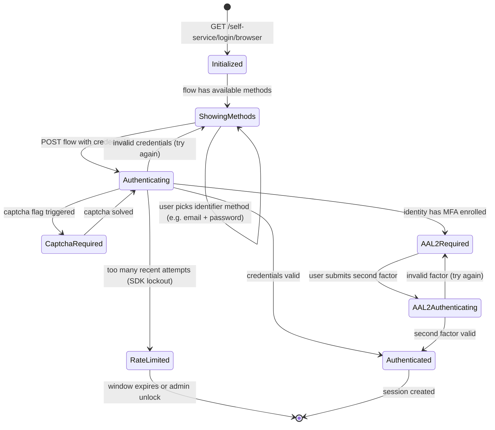

The Kratos login flow is a server-driven state machine. Hera renders whatever state Kratos returns; the user's submission advances the state. This page documents every state.

## State diagram



## Initiating the flow

For browser flows:

```
GET /self-service/login/browser?return_to=https://app.example.com/dashboard
```

Kratos:
1. Creates a flow record (with expiry, CSRF token, configured methods).
2. Redirects the browser to the configured UI URL with `?flow=FLOW_ID`.

The UI URL is configured per domain in `kratos.yml`:

```yaml
selfservice:
  flows:
    login:
      ui_url: http://localhost:3000/login   # CIAM Hera
```

For API clients (e.g. mobile apps):

```
GET /self-service/login/api
```

This returns the flow as JSON instead of redirecting. The client renders its own UI.

## Hera's role

Hera (`/login?flow=FLOW_ID`) calls Kratos:

```
GET /self-service/login/flows?id=FLOW_ID
```

The response includes:
- `ui.nodes` — the form fields to render (e.g. `identifier`, `password`, CSRF token).
- `ui.action` — the URL to POST the form back to.
- `ui.messages` — any validation errors or status messages.

Hera renders the form. The user submits.

## Submission

```
POST /self-service/login?flow=FLOW_ID
Content-Type: application/json

{
  "method": "password",
  "identifier": "user@example.com",
  "password": "...",
  "csrf_token": "..."
}
```

Kratos:
1. Verifies CSRF.
2. Verifies the flow hasn't expired.
3. Looks up the identifier in the credentials store.
4. Argon2 (or bcrypt) verifies the password.
5. On success: creates a session, sets a session cookie, and returns the next URL (usually `return_to`).
6. On failure: returns the flow with error messages; Hera re-renders the form.

## Olympus-specific checks

Beyond the standard Kratos flow, Hera adds two pre-Kratos checks:

### Brute-force lockout

Before calling Kratos, Hera consults the SDK's `login_attempts` / `lockouts` tables. If the identifier is locked out, Hera rejects the submission immediately and renders a "too many attempts" message — Kratos never sees the attempt.

See [Security — Brute-Force Protection](/docs/security/brute-force).

### Captcha

If captcha is required (configurable per deployment), Hera validates the Turnstile token with Cloudflare before passing the submission to Kratos. See [Security — Captcha Turnstile](/docs/security/captcha-turnstile).

## AAL2 step-up

If the identity has a second factor enrolled (TOTP, WebAuthn), Kratos returns the flow in the `aal2_required` state after the password is accepted. Hera renders the second-factor challenge; the user submits; Kratos completes the session.

The session's `authenticator_assurance_level` reflects what was actually used: `aal1` (password only), `aal2` (password + second factor).

See [Identity — TOTP and WebAuthn](/docs/identity/totp-and-webauthn) and [Identity — MFA Policy](/docs/identity/mfa-policy).

## Hydra integration (OAuth2 case)

When the user is logging in as part of an OAuth2 flow (the app's link sent them to `/oauth2/auth`), Hera receives an extra parameter `login_challenge=...`. After Kratos completes the login successfully, Hera:

1. Calls Hydra `PUT /admin/oauth2/auth/requests/login/accept` with the Kratos `identity.id` and the challenge.
2. Hydra resumes the OAuth2 flow and redirects to consent.

If the user already had a Kratos session, this whole chain is **skipped** — Hera detects the session and short-circuits straight to accepting the login challenge.

## Failure modes

| Failure | Symptom | Cause |
| --- | --- | --- |
| Flow expired | "This flow has expired" | Default flow TTL is 1 hour. User idled too long. Re-initiate the flow. |
| CSRF violation | 400 Bad Request | Browser cookies were cleared mid-flow; redirect cycle. |
| Invalid identifier | "Invalid credentials" | Email doesn't exist in this domain. Kratos doesn't distinguish missing vs wrong-password to prevent enumeration. |
| Invalid password | "Invalid credentials" | Same message; check the brute-force counter. |
| Locked out | "Too many attempts" | The identifier is locked. See [Operate — Locked Account Unlock](/docs/operate/locked-account-unlock). |
| Captcha failed | "Captcha verification failed" | Turnstile token rejected. User must try again (the Turnstile widget remounts). |
| Email not verified (if required) | Redirect to verification flow | The identity has an unverified email and `require_verified_address` hook is enabled. |

## Related

- [Identity — Flow Registration](/docs/identity/flow-registration) — the analogous flow for new identities.
- [Identity — Flow Recovery](/docs/identity/flow-recovery) — forgot-password.
- [Identity — Sessions, AAL, refresh](/docs/identity/sessions-aal-refresh)
- [Reference — Kratos API](/docs/reference/api/overview) — endpoint details.
- [Troubleshooting — Login loops](/docs/troubleshooting/login-loops) — most common Olympus login problem.
