The recovery flow handles the "I forgot my password" path. The user proves control of their email and resets the password.

## State diagram

```mermaid
stateDiagram-v2
    [*] --> Initialized: GET /self-service/recovery/browser
    Initialized --> ShowingEmailForm
    ShowingEmailForm --> SendingCode: POST flow with email
    SendingCode --> Sent: Kratos courier dispatches email
    Sent --> [*]: user closes tab; will follow link in email
    Sent --> Verified: user opens recovery link
    Verified --> ShowingPasswordForm
    ShowingPasswordForm --> ChangingPassword: POST with new password
    ChangingPassword --> ShowingPasswordForm: weak password (try again)
    ChangingPassword --> Complete: password updated; session granted
    Complete --> [*]
```



## Step 1: Request recovery

```
GET /self-service/recovery/browser
```

Kratos creates a flow and redirects to Hera (`/recovery?flow=FLOW_ID`).

The form has one field: the email of the account.

## Step 2: Submit email

```http
POST /self-service/recovery?flow=FLOW_ID
Content-Type: application/json

{ "email": "user@example.com", "csrf_token": "..." }
```

Kratos:
1. Looks up the identity by `email` identifier.
2. If found, generates a recovery code (HMAC-signed using `secrets.cipher`, see [ADR 0017](/docs/adrs/0017-recovery-hmac-token)).
3. Embeds the code in a recovery URL: `https://ciam.<domain>/recovery?flow=FLOW_ID&token=<code>`.
4. Sends the URL via Kratos courier.
5. Returns 200 to Hera. **Whether or not the email exists, the response is identical**, this prevents enumeration.

## Step 3: User clicks the link

```
GET /recovery?flow=FLOW_ID&token=<recovery-code>
```

Hera passes the token to Kratos. Kratos validates:
- The HMAC signature with `secrets.cipher`.
- The token hasn't been used (single-use).
- The token hasn't expired (default 1 hour).
- The associated flow is still active.

On success, Kratos returns the flow in `ChangingPassword` state.

## Step 4: User sets new password

```http
POST /self-service/recovery?flow=FLOW_ID
Content-Type: application/json

{ "method": "code", "code": "...", "csrf_token": "..." }
```

Then a settings flow is initiated for the password update:

```http
POST /self-service/settings?flow=NEW_SETTINGS_FLOW_ID
Content-Type: application/json

{ "method": "password", "password": "new-password", "csrf_token": "..." }
```

Kratos validates:
- Password complexity.
- HIBP breach check (Olympus addition).
- Password isn't the same as the previous one (configurable).

On success, the password is updated and a session is granted.

## Olympus additions

### Captcha

If captcha is enabled, the email submission requires a valid Turnstile token. This prevents recovery-flow abuse for email enumeration (yes, even though Kratos returns identical responses, the courier hitting your email provider's send-rate counts).

### HIBP breach check

The new password is checked against HaveIBeenPwned before commit. A breach hit rejects the change with "this password has appeared in data breaches."

### Account-lockout doesn't apply

Recovery isn't a login, the brute-force lockout doesn't gate it. (Brute-force protection at the email-sending layer is different, see [Security, Rate Limiting](/docs/security/web-attacks/rate-limiting) for Caddy-level rate-limit on `/self-service/recovery`.)

## What if the user is logged in?

If the user has an active Kratos session and goes through recovery, the new password is set on their identity and the existing session continues. They're not logged out; they don't need to log back in.

## Failure modes

| Symptom | Cause |
| --- | --- |
| "If your email is on file, you'll receive a recovery link" but no email | Either the email isn't in the database (intentional non-disclosure), or the courier failed. Check Athena → Messages or MailSlurper in dev. |
| Link clicks return "this recovery link has expired" | Token TTL exceeded (default 1 hour). Re-initiate. |
| Link clicks return "token already used" | Single-use; user clicked the link twice. Re-initiate. |
| Email arrives but link goes to wrong domain | Kratos `selfservice.flows.recovery.ui_url` is misconfigured. Verify in [Reference, kratos.yml](/docs/reference/config/kratos-yml). |
| "This password has appeared in data breaches" | The new password is in HIBP. Pick a different one. |

## Related

- [Identity, Flow login](/docs/identity/flow-login)
- [Identity, Flow verification](/docs/identity/flow-verification)
- [Identity, Flow settings](/docs/identity/flow-settings)
- [ADR 0017, Recovery HMAC token](/docs/adrs/0017-recovery-hmac-token)
- [Security, Breached Password](/docs/security/identity-protection/breached-password)
