The registration flow is the path a new user takes from "I want an account" to "I have a valid Kratos identity with a verified email and an active session."

## State diagram

```mermaid
stateDiagram-v2
    [*] --> Initialized: GET /self-service/registration/browser
    Initialized --> ShowingForm: flow has form schema
    ShowingForm --> Validating: POST flow with traits + password
    Validating --> ShowingForm: validation error (e.g. weak password, invalid email)
    Validating --> CaptchaRequired: captcha flag triggered
    Validating --> BreachCheck: password to be checked against HIBP
    BreachCheck --> ShowingForm: password is in known breaches
    BreachCheck --> Created: password not in breaches
    CaptchaRequired --> Validating: captcha solved
    Created --> VerificationSent: verifiable address triggers verification flow
    VerificationSent --> SessionGranted: hooks pass; session cookie set
    SessionGranted --> [*]
```



## Initiating the flow

```
GET /self-service/registration/browser?return_to=https://app.example.com/welcome
```

Kratos:
1. Creates a registration flow record.
2. Redirects to the configured UI URL (`http://localhost:3000/registration` in dev) with `?flow=FLOW_ID`.

## Hera's role

Hera renders the registration form by reading the flow's `ui.nodes` from Kratos. The schema-driven UI means adding a trait to the identity schema **automatically** adds the field to the registration form.

If captcha is enabled, Hera renders the Turnstile widget; the user must solve it before submission is accepted.

## Submission

```
POST /self-service/registration?flow=FLOW_ID
Content-Type: application/json

{
  "method": "password",
  "traits": { "email": "new@example.com", "name": { "first": "Alex" } },
  "password": "MySecurePass123!",
  "csrf_token": "..."
}
```

Kratos validates:
- The traits conform to the identity schema (correct types, required fields present, format validations like `email` pass).
- The password meets the configured strength (length, character classes).
- The password is not in the breach list (Olympus enforces, see [Security, Breached Password](/docs/security/identity-protection/breached-password)).
- No identity already exists with the same identifier.

## Captcha (Olympus addition)

Before passing to Kratos, Hera validates the Turnstile token. See [Security, Captcha Turnstile](/docs/security/web-attacks/captcha-turnstile).

## Breached-password check (Olympus addition)

After Kratos accepts the password complexity rules, the Olympus SDK checks the password against HaveIBeenPwned's k-anonymity API. A match is treated as "weak" and the registration is rejected with a "this password has appeared in data breaches" message.

The k-anonymity model means: the SDK sends only the first 5 characters of the SHA-1 hash; HIBP returns all matching hash suffixes; the SDK checks locally. The full password is never sent over the network.

See [Security, Breached Password](/docs/security/identity-protection/breached-password) for the implementation.

## Verification trigger

If the identity schema declares any trait as `verification: { via: "email" }`, Kratos triggers a verification flow as part of registration:

1. A verification token is generated and HMAC-signed using `secrets.cipher`.
2. The token is embedded in a verification URL.
3. Kratos's courier sends the URL via email.
4. The user clicks the link, hits Hera's verification page, the token is validated, and `verifiable_addresses.<email>.verified` becomes `true`.

The session can be granted before or after verification depending on hooks:
- `kratos.yml` → `selfservice.flows.registration.after.password.hooks: [{hook: session}]` → session granted immediately on registration.
- `[{hook: require_verified_address}]` → registration succeeds but session is not granted until verification.

Olympus's default is **session-on-registration** but with prominent verification reminders in the UI. Production deployments often switch to `require_verified_address` for security-critical apps. See [Security, Email Verification](/docs/security/identity-protection/email-verification) for the decision and the prod-enforcement CI gate.

## Post-registration hooks

You can hook into the post-registration moment to:
- Send a welcome email (via your own SMTP, separate from Kratos's courier).
- Provision per-user resources in your application database.
- Add the new identity to a default group / role.

Hook config example:

```yaml
selfservice:
  flows:
    registration:
      after:
        password:
          hooks:
            - hook: web_hook
              config:
                url: https://app.example.com/internal/post-registration
                method: POST
                auth:
                  type: api_key
                  config:
                    name: Authorization
                    value: Bearer YOUR_INTERNAL_TOKEN
                    in: header
                body: file:///etc/config/kratos/hooks/post-registration.jsonnet
```

Webhooks are configured in `kratos.yml` and run synchronously, slow hooks block registration. Use them for synchronous post-registration that must succeed.

## Failure modes

| Error | Cause | Fix |
| --- | --- | --- |
| Validation fail: "email is already in use" | Identity with this identifier exists | Use a different email or use the login flow instead. |
| Validation fail: "password is too short" | Below `password.min_length` (default 8) | Increase length. |
| Validation fail: "this password has appeared in data breaches" | HIBP match | Use a unique password (not one from your password manager's "compromised" list). |
| 400 captcha verification failed | Turnstile token invalid or expired | The widget remounts; user submits again. |
| 400 CSRF violation | Lost cookie mid-flow | Refresh the registration form. |

## Schema-driven UI: pitfalls

When you add a new trait to the schema, Hera renders the new field automatically. But:

- The field's `title` becomes the label. If you don't set `title`, users see the raw key (`shipping_address.country` rather than "Country").
- Field order is the order in the JSON Schema, control it by ordering the `properties` keys.
- For complex fields (nested objects, arrays), the rendered UI may be awkward. Add per-trait custom rendering in Hera if needed.

## Related

- [Identity, Identity schemas](/docs/identity/identity-schemas), what schemas govern.
- [Identity, Flow login](/docs/identity/flow-login), the post-registration login path.
- [Identity, Flow verification](/docs/identity/flow-verification)
- [Security, Captcha Turnstile](/docs/security/web-attacks/captcha-turnstile)
- [Security, Breached Password](/docs/security/identity-protection/breached-password)
- [Security, Email Verification](/docs/security/identity-protection/email-verification)
