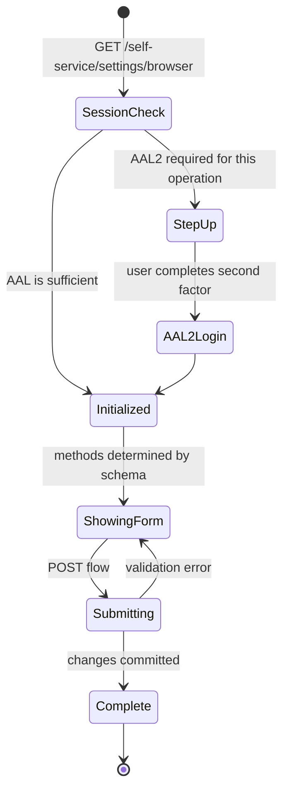

The settings flow lets a logged-in user change their identity: update traits (name, email), change password, enroll/disenroll TOTP or WebAuthn, link/unlink social IdPs.

Settings flows are **session-authenticated** — the user must have an active session (AAL1 minimum, AAL2 for security-sensitive operations).

## What can be changed

The available methods in the settings flow correspond to the credential types and traits configured in the identity schema:

| Method | Operation |
|---|---|
| `profile` | Update non-credential traits (name, locale, etc.). |
| `password` | Change password (requires re-auth via current password). |
| `totp` | Enroll or disenroll TOTP. |
| `webauthn` | Add or remove WebAuthn credentials. |
| `lookup_secret` | Generate or revoke backup codes. |
| `oidc` | Link or unlink a social IdP. |

## State diagram (per method)



## Step-up to AAL2

Sensitive operations (changing password, disenrolling MFA, linking/unlinking IdPs) trigger an AAL2 requirement. If the user's session is AAL1, Kratos returns the flow with a "step up to AAL2" indication; Hera renders the second-factor challenge.

This protects against session-cookie-stolen-while-AAL1 attackers from modifying credentials.

See [Identity — Sessions, AAL, refresh](/docs/identity/sessions-aal-refresh).

## Password change

```http
POST /self-service/settings?flow=FLOW_ID
Content-Type: application/json

{ "method": "password", "password": "new-password", "csrf_token": "..." }
```

Validates:
- Password complexity per `kratos.yml`.
- HIBP breach check (Olympus).
- Different from previous password (configurable).

The user's other sessions are **not invalidated** by default. If you want password change to log everyone else out, configure the `revoke_active_sessions` hook on `settings.after.password`.

## TOTP enrollment

```http
POST /self-service/settings?flow=FLOW_ID
Content-Type: application/json

{ "method": "totp", "totp_secret": "...", "csrf_token": "..." }
```

The flow returns a TOTP secret + QR code URL. The user scans into Google Authenticator / Authy / 1Password. To confirm, the user enters a generated code:

```http
POST /self-service/settings?flow=FLOW_ID
Content-Type: application/json

{ "method": "totp", "totp_code": "123456", "csrf_token": "..." }
```

The TOTP credential is stored on the identity. From then on, MFA enrollment counts as a second factor.

See [Identity — TOTP and WebAuthn](/docs/identity/totp-and-webauthn).

## WebAuthn registration

```http
POST /self-service/settings?flow=FLOW_ID
Content-Type: application/json

{ "method": "webauthn", "webauthn_register": "<credential JSON>", "csrf_token": "..." }
```

The credential JSON comes from the browser's `navigator.credentials.create()` call. Hera handles this via a WebAuthn JS library — your operators don't see the raw protocol.

## Profile (trait) updates

```http
POST /self-service/settings?flow=FLOW_ID
Content-Type: application/json

{ "method": "profile", "traits": { "name": { "first": "New", "last": "Name" } }, "csrf_token": "..." }
```

Traits are validated against the identity schema. Updates to verified traits (e.g. changing email) typically trigger re-verification — see [Identity — Flow verification](/docs/identity/flow-verification).

## OIDC link/unlink

```http
POST /self-service/settings?flow=FLOW_ID
Content-Type: application/json

{ "method": "oidc", "link": "google", "csrf_token": "..." }
```

Initiates an OIDC redirect to the IdP. On return, the IdP credential is associated with the identity.

Unlink:

```http
POST /self-service/settings?flow=FLOW_ID
{ "method": "oidc", "unlink": "google", "csrf_token": "..." }
```

Olympus does not allow unlinking the last credential — if Google is the user's only login method, they'd be locked out. The unlink is rejected with `last_credential_protection`.

See [Identity — Account linking](/docs/identity/account-linking).

## Failure modes

| Symptom | Cause |
| --- | --- |
| "Step up to AAL2 required" | The user has MFA enrolled but their session is AAL1. They must complete the second factor first. |
| "Password is too weak" | Below min length or simple. Try a different password. |
| "Password is in known breaches" | HIBP match. |
| "Cannot unlink the last credential" | Would lock the user out. Add another credential first. |
| "Flow expired" | Default 1-hour TTL. Re-initiate. |

## Related

- [Identity — Flow login](/docs/identity/flow-login)
- [Identity — TOTP and WebAuthn](/docs/identity/totp-and-webauthn)
- [Identity — Sessions, AAL, refresh](/docs/identity/sessions-aal-refresh)
- [Identity — Account linking](/docs/identity/account-linking)
