The verification flow proves the user controls an identifier (typically email). Successful verification marks `verifiable_addresses.<value>.verified=true` on the identity.

In Olympus production, **verification is mandatory** before a user is considered fully active — see [Security — Email verification](/docs/security/email-verification) and the `verify-email-enforcement.yml` CI gate.

## State diagram

```mermaid
stateDiagram-v2
    [*] --> Initialized: GET /self-service/verification/browser
    Initialized --> ShowingEmailForm: ask which address to verify
    ShowingEmailForm --> SendingCode: POST with email
    SendingCode --> Sent: courier dispatches verification email
    Sent --> [*]: user closes tab; will follow link
    Sent --> Verified: user opens verification link
    Verified --> [*]: address marked verified
```



## When verification is initiated

There are three triggers:

1. **Automatic post-registration**: if your `kratos.yml` includes the verification hook in the registration after-flow:
   ```yaml
   selfservice:
     flows:
       registration:
         after:
           password:
             hooks:
               - hook: verification
   ```
2. **User self-initiated**: the user clicks "Verify email" in their settings (settings flow).
3. **Resend**: from Athena admin, an operator can resend the verification for a stuck user.

## Flow detail

```
GET /self-service/verification/browser?return_to=https://app.example.com/
```

Kratos creates a verification flow. Hera renders the form (with the email pre-filled if the user is logged in).

Submission:

```http
POST /self-service/verification?flow=FLOW_ID
Content-Type: application/json

{ "email": "user@example.com", "method": "code", "csrf_token": "..." }
```

Kratos:
1. Generates a verification code (HMAC-signed via `secrets.cipher`).
2. Embeds in a URL.
3. Sends via courier.
4. Returns 200.

User clicks the link. Kratos validates:
- The HMAC.
- Token not used.
- Token not expired (default 1 hour).
- The address still belongs to the identity.

On success, `verifiable_addresses.<email>.verified=true` and the courier dispatches a confirmation email.

## Trust contract: external IdPs

When a user logs in via Google/GitHub/etc., the OIDC IdP may include `email_verified=true` in the ID token. **Olympus does not trust this.** Kratos always runs its own verification.

The reasoning: an attacker who controls a domain (via takeover, MX hijacking, mailbox squatting) could obtain an Auth0/Google account with `email_verified=true` that matches an Olympus identity's email. Honoring upstream verification would allow takeover via social login pre-linking.

See [Security — OIDC email_verified trust](/docs/security/oidc-email-verified-trust) and [ADR 0011](/docs/adrs/0011-json-schema-identity).

## Enforcement: blocking unverified users

By default, Kratos lets unverified users access their account but limits some operations. To block all access until verification:

```yaml
selfservice:
  flows:
    login:
      after:
        password:
          hooks:
            - hook: require_verified_address
```

The `require_verified_address` hook fires after every login. If the user isn't verified, they're redirected to the verification flow.

Olympus production deployments enable this hook — verified by `verify-email-enforcement.yml` CI workflow.

## Multi-step verification (rare)

If your identity schema has multiple verifiable traits (email + phone), Kratos can verify each independently. Phone verification requires an SMS provider; not currently supported in Olympus's default courier config.

## Failure modes

| Symptom | Cause |
| --- | --- |
| User reports never receiving verification email | Check MailSlurper (dev) or your email provider's deliverability dashboard. SPAM folder is the usual culprit. Re-send from Athena. |
| Verification link expired | Default 1 hour TTL. Re-initiate. |
| User stuck: link works but no session | Verify hook configuration — `require_verified_address` may be triggering a redirect loop. |
| Multiple emails sent quickly (user clicked "resend" repeatedly) | Configure flow rate limit; the user will eventually see "too many recent requests, try again in N minutes." |

## Related

- [Identity — Flow recovery](/docs/identity/flow-recovery)
- [Identity — Flow registration](/docs/identity/flow-registration)
- [Security — Email verification](/docs/security/email-verification)
- [Security — OIDC email_verified trust](/docs/security/oidc-email-verified-trust)
