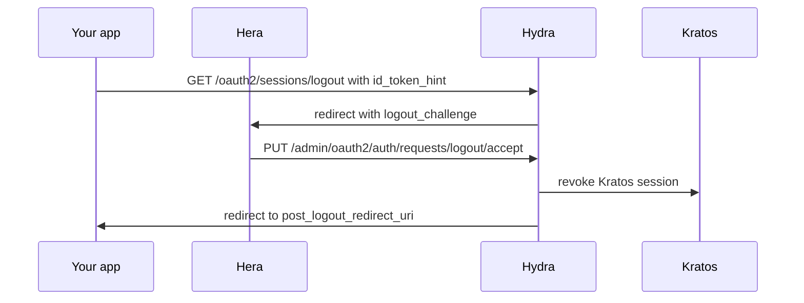

OIDC defines a standard "RP-initiated logout" flow that lets your application end its own session **and** sign the user out of Olympus at the same time. This is what you want when a user clicks "Log out" in your app.

## The endpoint

```
GET https://<hydra-host>/oauth2/sessions/logout
  ?id_token_hint=<the id_token issued during login>
  &post_logout_redirect_uri=<where to send the user after logout>
  &state=<optional CSRF token>
```

Olympus exposes this on both CIAM Hydra and IAM Hydra:

- CIAM: `https://ciam.<your-domain>/oauth2/sessions/logout`
- IAM: `https://iam.<your-domain>/oauth2/sessions/logout`

## The flow



## What gets revoked

When you complete the flow:
- The user's **Kratos session** (the browser's auth cookie at the CIAM/IAM domain).
- The user's **Hydra session** for that OAuth2 client (their consent grants stay; their active token doesn't get revoked unless you also revoke).

Refresh tokens and access tokens issued previously are **not automatically revoked**. If you need that, call `/oauth2/revoke` explicitly before the logout.

## Required: `post_logout_redirect_uri` allowlist

Hydra requires the `post_logout_redirect_uri` to be on your OAuth2 client's allowlist. Add it when creating the client in Athena, or update an existing client:

```bash
hydra update client <client_id> \
  --endpoint http://localhost:3103 \
  --post-logout-callback-uri https://app.example.com/logged-out
```

If the URI isn't allowed, Hydra returns an error and doesn't redirect.

## Required: `id_token_hint`

You must include the user's most recent `id_token` as `id_token_hint`. This is how Hydra knows which user to log out.

Where to get it:
- You stored it when the user logged in. (You should, it's needed for logout.)
- Or you re-derive it via the userinfo endpoint and check the `sub` claim, but `id_token_hint` is the official mechanism.

## In your app

A typical "Logout" button handler:

```ts
function logout(idToken: string) {
  const params = new URLSearchParams({
    id_token_hint: idToken,
    post_logout_redirect_uri: "https://app.example.com/logged-out",
    state: crypto.randomUUID(),
  });
  window.location.href = `https://ciam.your-domain/oauth2/sessions/logout?${params}`;
}
```

After the redirect chain, the user lands on your `/logged-out` page. The Kratos cookie at `ciam.your-domain` is gone; future visits to `ciam.your-domain` trigger the login flow.

## Confirmation prompt

Hydra normally shows a "Do you want to log out?" prompt via Hera. This protects against accidental logout from third-party content.

If you don't want the prompt (your app explicitly initiated the logout), you can skip it, Hera's logout page auto-accepts if it sees a valid `logout_challenge` and a recent session interaction.

The skip-prompt logic lives in Hera's `/logout` page. The default in Olympus is to skip when the request comes via `post_logout_redirect_uri` that matches an allowed URI.

## Logging out of only the OAuth2 client (not Kratos)

If you want the user to stay logged into Kratos (so they don't have to re-enter their password) but invalidate their Hydra session for your client, use:

```bash
# Revoke the consent for this client
curl -X DELETE "http://localhost:3103/admin/oauth2/auth/sessions/consent?subject=USER_ID&client=CLIENT_ID"
```

This is uncommon, most "logout" really means "end the Kratos session."

## Front-channel logout

OIDC also supports **front-channel logout**, multiple RPs subscribe to a logout event and get notified when the user logs out of any of them. Hydra supports this via the `frontchannel_logout_uri` client field.

For most Olympus deployments, single-RP logout is sufficient. Front-channel becomes relevant for SSO portals with many connected apps.

## Related

- [Integrate, OAuth2 overview](/docs/integrate/oauth2/oauth2-overview)
- [Reference, Hydra rejectoauth2logoutrequest](/docs/reference/api/hydra/oauth2/rejectoauth2logoutrequest)
- [Reference, Hydra acceptoauth2logoutrequest](/docs/reference/api/hydra/oauth2/acceptoauth2logoutrequest)
