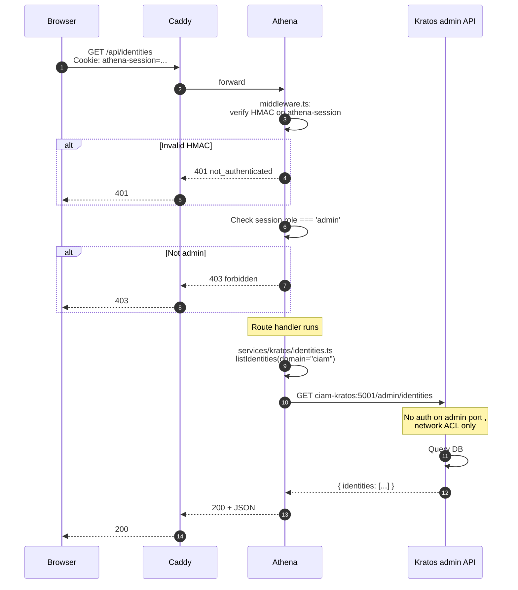

## Layers

1. **Caddy**, TLS termination, basic rate-limit.
2. **Athena middleware**, verifies session HMAC, checks role.
3. **Service layer**, encapsulates the Kratos API call (testable in isolation).
4. **Kratos admin API**, no auth, protected by network ACL only.

## Why Kratos admin has no auth

Kratos's admin port is on the **intranet network only**, never publicly exposed ([Operate, Network topology](/docs/operate/administration/network-topology)). The network boundary is the auth. The host firewall blocks the port from the internet.

## Where to learn more

- [Reference, Athena API authentication](/docs/reference/api-athena-authentication)
- [Internals, Athena middleware](/docs/internals/athena/athena-middleware)
- [Internals, Athena service layer](/docs/internals/athena/athena-service-layer)
