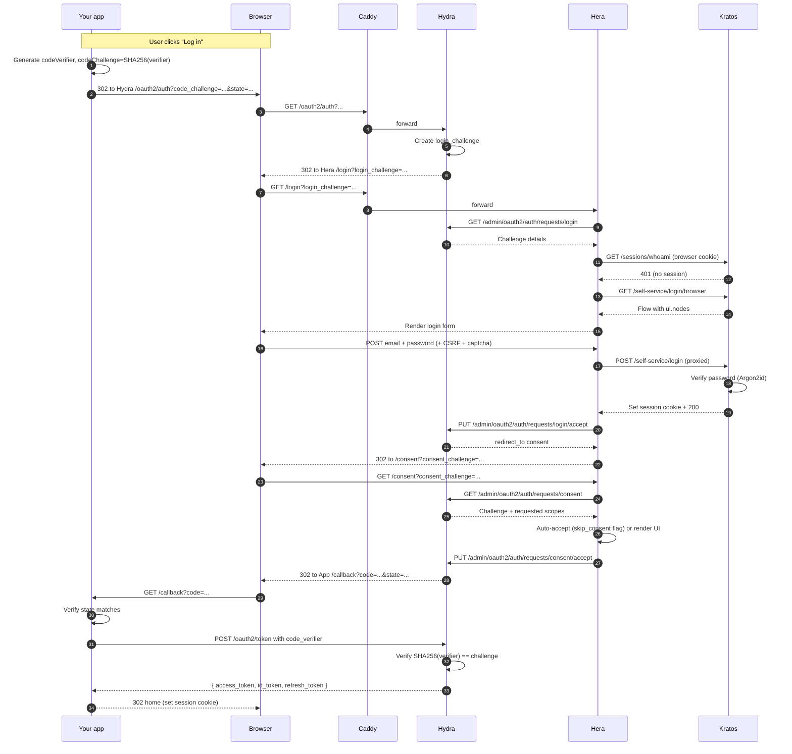

## What's happening

- **Step 1-3**: App initiates. PKCE pair generated client-side.
- **Step 4-9**: Hydra delegates to Hera (no session yet). Hera renders login form via Kratos.
- **Step 10-14**: User authenticates against Kratos. Kratos sets browser session cookie. Hera tells Hydra "this is identity X."
- **Step 15-18**: Consent. Either auto-grant (first-party client) or render UI.
- **Step 19-24**: Hydra issues code, app exchanges for tokens. PKCE verifier proves the original initiator.

## Where this is wired

- [Identity, Flow login](/docs/identity/flow-login), the Kratos half.
- [Integrate, OAuth2 PKCE](/docs/integrate/oauth2/oauth2-pkce), the integrator's perspective.
- [Internals, Hera Hydra integration](/docs/internals/hera/hera-hydra-integration), how the consent challenge is handled.
- [Security, PKCE enforcement](/docs/security/identity-protection/pkce-enforcement), why PKCE is mandatory.
