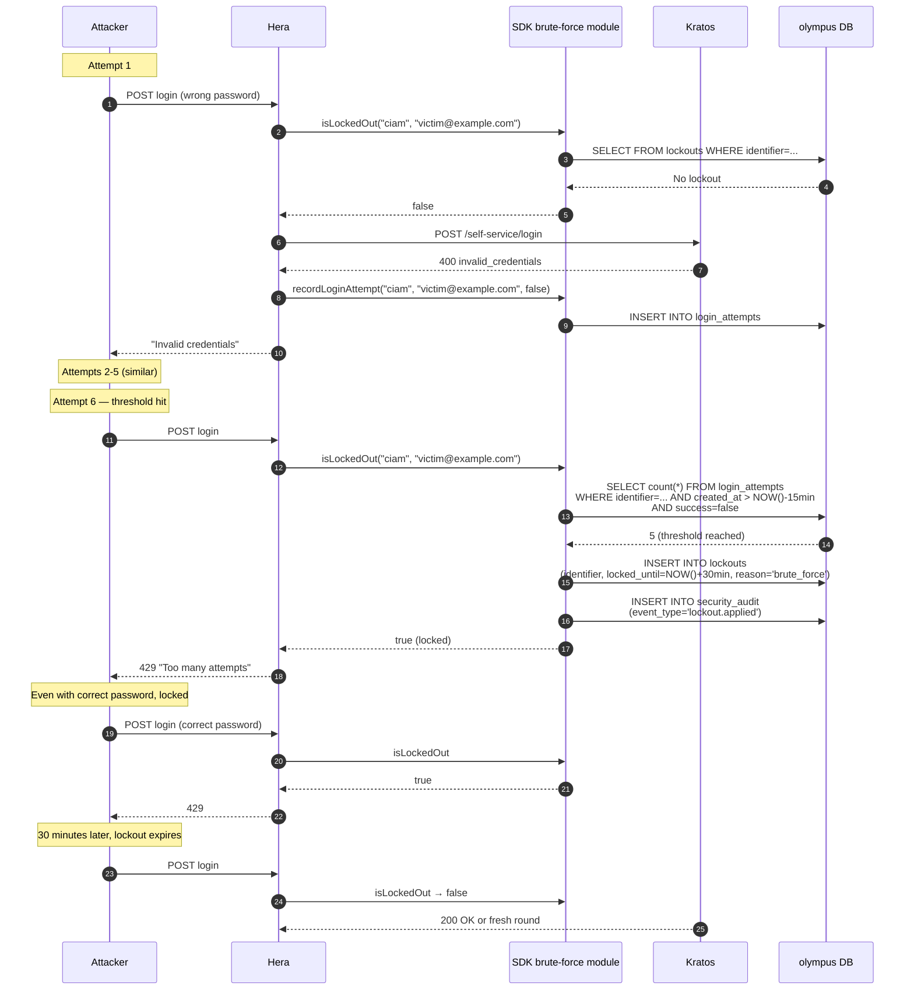

## Independent of Caddy rate limit

The lockout is **per identifier**. The Caddy rate limit is **per IP**. Both fire independently. A distributed attack across many IPs hits the SDK lockout; a single-IP burst hits Caddy first.

## Manual unlock

Admins can unlock via Athena → Locked Accounts. See [Operate — Locked account unlock](/docs/operate/locked-account-unlock).

## Where to learn more

- [Security — Brute-force protection](/docs/security/brute-force)
- [Security — Account lockout](/docs/security/account-lockout)
- [Cookbook — Test brute-force locally](/docs/cookbook/test-brute-force-locally)
