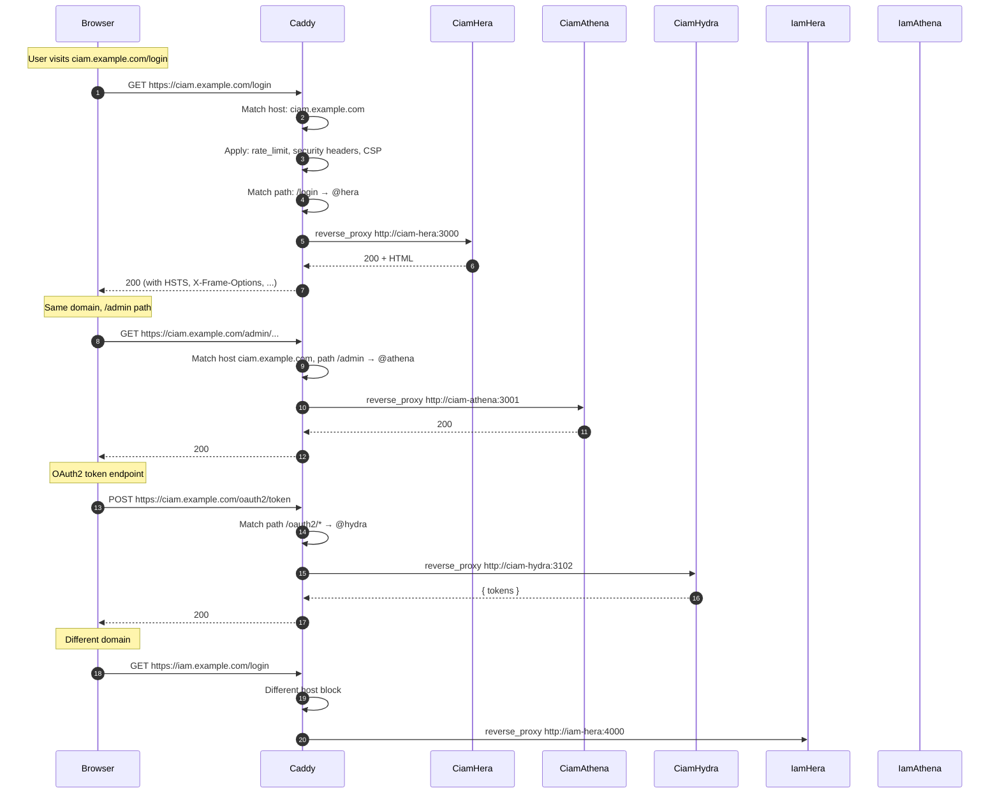

## Per-host blocks

Each domain has its own Caddyfile block. Path matchers route within the block.

## What Caddy DOES NOT route

- **The admin API ports** (3101, 3103, 4101, 4103), these are intranet-only; Caddy doesn't proxy to them.
- **Postgres** (5432), direct DB connection from app containers; not via Caddy.

## Where to learn more

- [Operate, Network topology](/docs/operate/administration/network-topology)
- [Reference, Caddyfile](/docs/reference/config/caddy/overview)
- [Security, Caddy supply chain](/docs/security/infrastructure/caddy-supply-chain)
