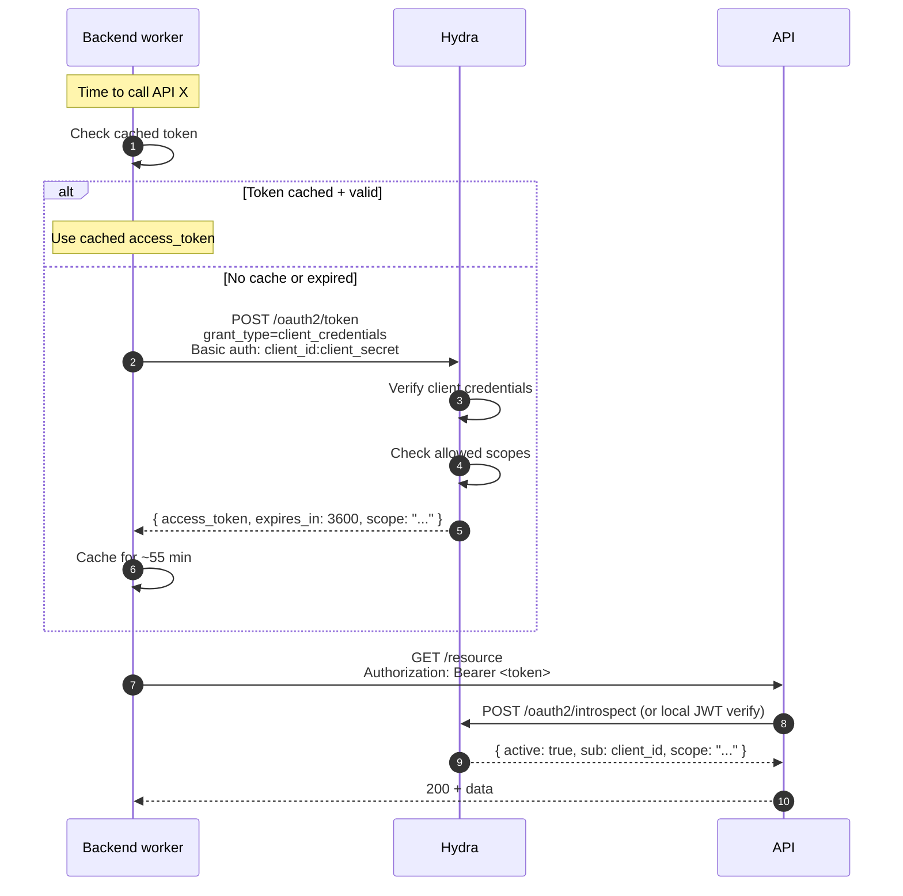

## Properties

- **No user involved.** The `sub` claim is the `client_id`, not a user UUID.
- **No refresh token.** Worker just requests a new one when needed.
- **No ID token.** Pure machine identity.
- **Short TTL** (1 hour default). Cache and renew on expiry.

## Where to learn more

- [Integrate — OAuth2 client credentials](/docs/integrate/oauth2-client-credentials)
- [Cookbook — M2M call from a worker](/docs/cookbook/m2m-call-from-worker)
- [Reference — OAuth2 grant: client-credentials](/docs/reference/grants/client-credentials)
