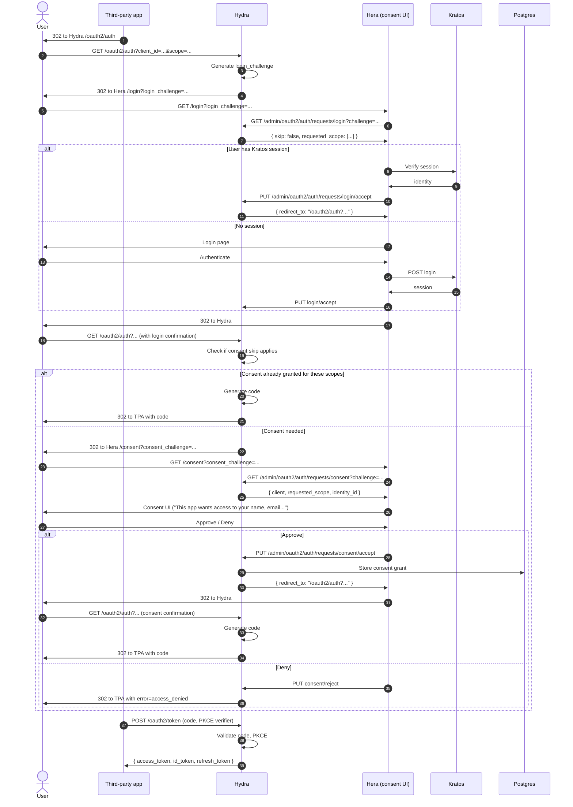

OAuth2's hardest UX moment: "Do you authorize MyThirdPartyApp to access your data?" This is split across Hydra (the OAuth2 server) and Hera (which renders the UI).

## Sequence



## Key moments

### Login vs consent challenges

Hydra emits two challenges:
- **login_challenge**: "make this user prove they're who they say they are."
- **consent_challenge**: "did this user agree to grant the requested scopes?"

Both are presented to Hera as a hash. Hera fetches the details via Hydra's admin API.

### Skip behavior

Hydra has a `skip` field on each request:
- Login skip: user already has an active SSO session at Hydra level (separate from Kratos session). Defaults: false on first login.
- Consent skip: user previously granted these scopes for this client. Defaults: true if scopes are a subset of previously granted.

### The "double redirect"

You see `GET /oauth2/auth?...` twice — once initially, once after login (step 17). This is because Hydra splits authentication and authorization into two passes:
1. First pass: determine if login is needed. If so, redirect to Hera. If not, proceed.
2. Second pass: determine if consent is needed. If so, redirect to Hera. If not, issue code.

This makes it possible to skip individual steps without re-walking the whole flow.

### Storing consent grants

Step 22: Hydra writes a `hydra_oauth2_consent_request` row. Future requests for the same `(client_id, identity_id, scope)` combination skip the consent screen.

To revoke: delete from `hydra_oauth2_consent_request`, OR call Hydra's admin API:

```bash
hydra revoke consent --identity-id <uuid> --client-id <client>
```

### What scopes are displayed

Hera reads `requested_scope` from the consent request and renders user-friendly labels:

```ts
const labels = {
  "openid": "Your OpenID",
  "profile": "Your basic profile (name, photo)",
  "email": "Your email address",
  "offline_access": "Access your data while you're offline",
  "api:read": "Read access to your data",
  "api:write": "Modify your data",
};
```

Customize per your app.

### Brand the consent screen

The consent screen is just Hera. To brand per-client:

```ts
// hera consent page
const client = await fetch(`${HYDRA_ADMIN}/admin/clients/${clientId}`).then(r => r.json());
// client.logo_uri, client.client_name, client.policy_uri, client.tos_uri
```

Render the client's logo + name in the consent prompt. Users trust real branding more than generic "Authorize app?".

## Edge cases

### User clicks "Deny"

Step 25 alt: `consent/reject`. Hydra redirects back to TPA with `error=access_denied`. TPA must handle this gracefully (show "You declined").

### User abandons mid-consent

Flow expires after configured TTL (default 30 min). Next request: fresh login_challenge.

### Same scope, different audience

If client A and client B both request `api:read`, the consent is independent — granting to A doesn't grant to B. Trust boundary is per-client.

### "Trusted" first-party clients

For your own apps (your dashboard, your mobile app), users shouldn't see a consent screen at all. Mark the client `trusted: true` or use `skip_consent`:

```bash
hydra update client <id> --skip-consent
```

OR auto-accept consent in your Hera consent handler if `client.metadata.first_party === true`.

## See also

- [Identity — OAuth2 consent](/docs/identity/oauth2-consent)
- [Cookbook — Brand consent screen](/docs/cookbook/brand-consent-screen)
- [Reference — OAuth2 grants — Authorization Code](/docs/reference/oauth2/grant-authorization-code)
- [Reference — Diagrams — Authorization Code + PKCE](/docs/reference/diagrams/seq-authorization-code-pkce)
