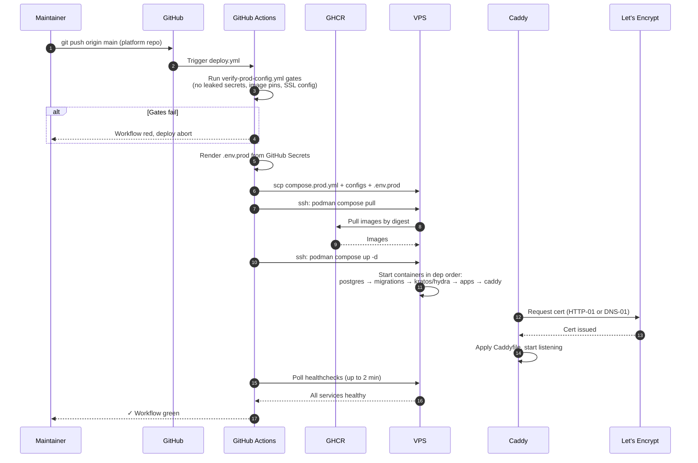

## Gates before deploy

The `verify-prod-config.yml` workflow enforces:
- No literal secrets in compose / config files.
- `sslmode=verify-full` in every DATABASE_URL.
- All images digest-pinned (no `:latest` or floating tags).
- Kratos `leak_sensitive_values: false`.
- Email verification hook configured.

A red gate stops the deploy.

## End-to-end time

~3 minutes for a normal deploy. First-time deploy with cert issuance: ~5 minutes.

## Rollback

Revert the compose digest, commit, push. Deploy workflow runs again, pulls the older images.

## Where to learn more

- [Internals, Platform deploy pipeline](/docs/internals/platform/platform-deploy-pipeline)
- [Deploy, First production deploy](/docs/deploy/production/first-production-deploy)
- [ADR 0014, Image digest pinning](/docs/adrs/0014-image-digest-pinning)
