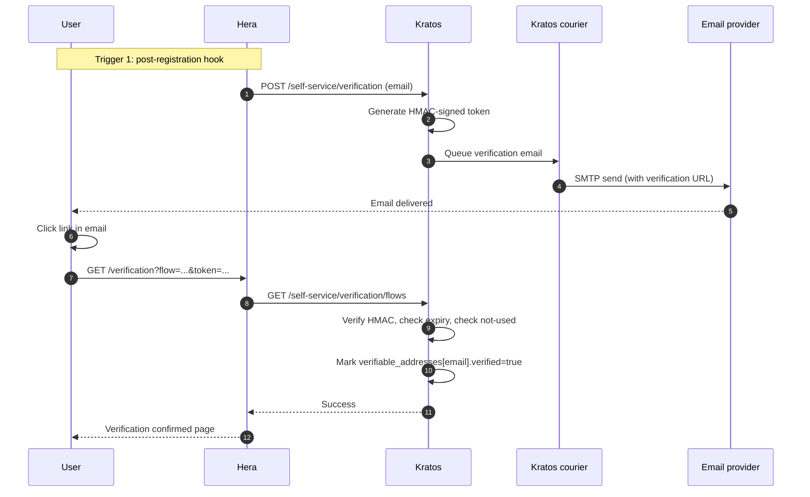

## Token format

The verification token is HMAC-signed with `secrets.cipher` from `kratos.yml`. See [ADR 0017 — Recovery HMAC token](/docs/adrs/0017-recovery-hmac-token) — same primitive.

## TTL

Default 1 hour. After expiry, user re-initiates the verification flow.

## Olympus enforcement

Production deployments enable `require_verified_address` hook on registration AND login. Unverified users cannot get a session — see [Security — Email verification](/docs/security/email-verification).

## Where to learn more

- [Identity — Flow verification](/docs/identity/flow-verification)
- [Security — Email verification](/docs/security/email-verification)
