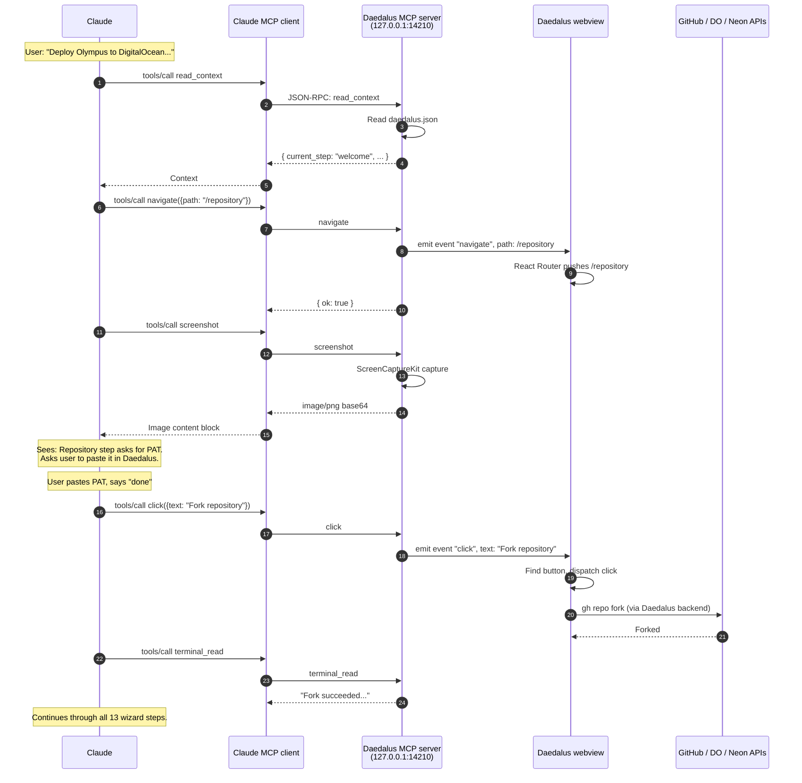

## Localhost-only

The MCP server binds to `127.0.0.1` only. Claude must run on the same machine. See [ADR 0022 — MCP localhost only](/docs/adrs/0022-mcp-localhost-only).

## Where to learn more

- [Integrate — MCP with Daedalus](/docs/integrate/mcp-with-daedalus)
- [Cookbook — Deploy with Claude MCP](/docs/cookbook/deploy-with-claude-mcp)
- [Internals — Daedalus MCP server](/docs/internals/daedalus-mcp-server)
