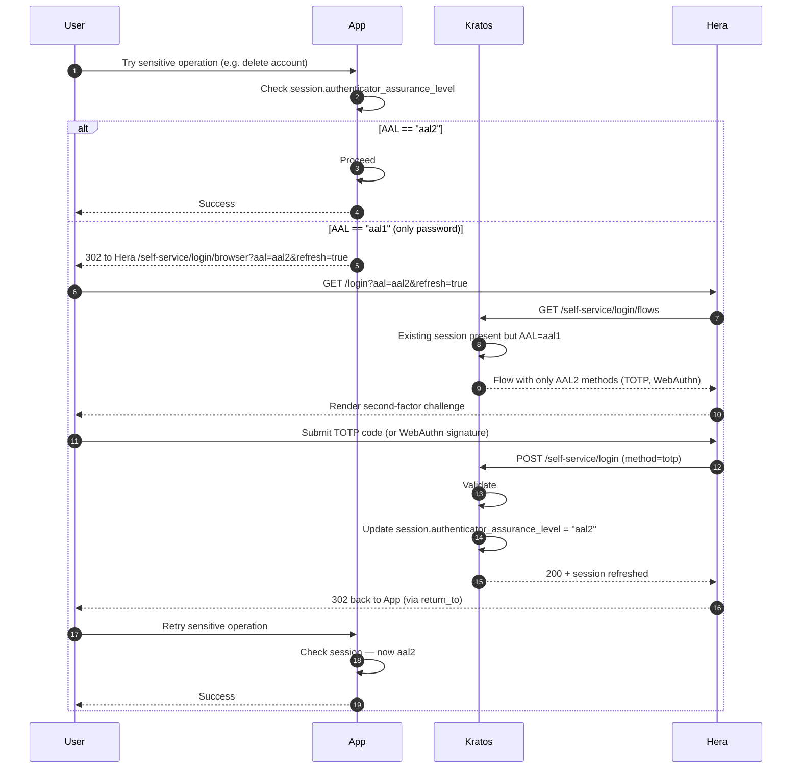

## Where AAL2 is required

Kratos's default policy:
- Changing password (settings flow)
- Disenrolling MFA
- Linking/unlinking last credential
- Any operation marked `required_aal: aal2` in `kratos.yml`

Your app can require AAL2 for its own sensitive operations following the pattern above.

## Where to learn more

- [Identity — Sessions, AAL, refresh](/docs/identity/sessions-aal-refresh)
- [Identity — MFA policy](/docs/identity/mfa-policy)
- [Cookbook — Enforce step-up auth](/docs/cookbook/enforce-step-up-auth)
- [Troubleshooting — Session AAL too low](/docs/troubleshooting/kratos-session-aal-too-low)
