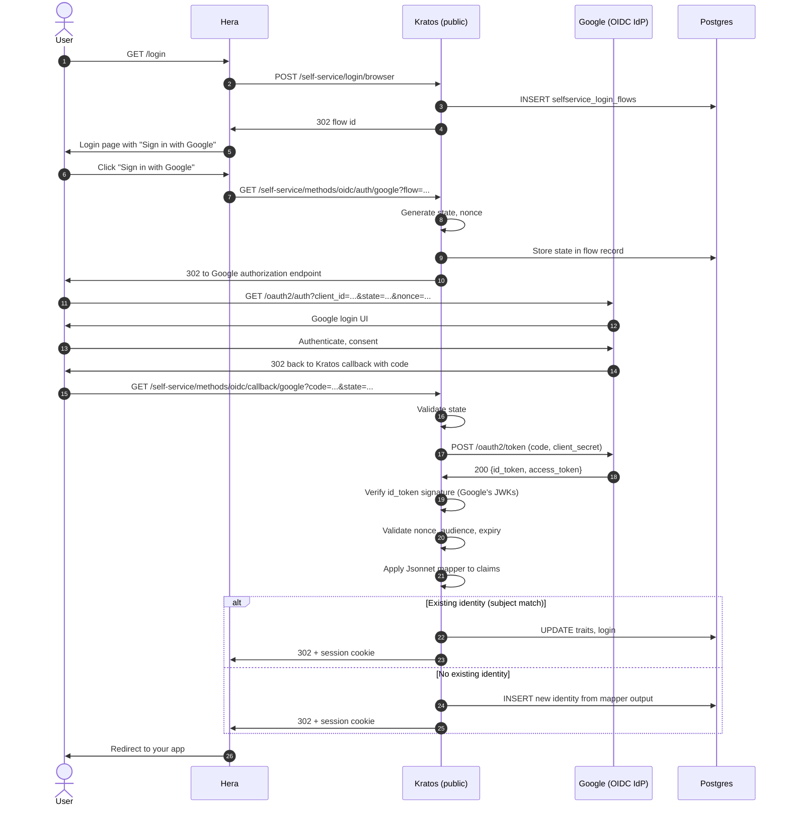

## Sequence



## What's interesting

### State and nonce

Step 9: Kratos generates and stores both:
- **State**: random value tied to this flow. Verifies the callback is for this user's session (CSRF protection).
- **Nonce**: random value sent to Google, must be in the returned id_token. Prevents token-replay attacks.

If state doesn't match (step 16), Kratos rejects. If nonce doesn't match (step 20), Kratos rejects.

### Code exchange

Step 17-18: Kratos exchanges the authorization code for tokens directly with Google (backend-to-backend). The user's browser never sees Google's tokens.

This is Authorization Code grant — appropriate because Kratos can hold a client_secret. (For pure SPAs, you'd use PKCE without client_secret; Kratos uses the secret because it's a confidential client to Google.)

### Token verification

Step 19-20:
- Fetch Google's JWKS (cached).
- Verify id_token signature with the matching key.
- Check `iss == https://accounts.google.com`.
- Check `aud == OLYMPUS_CLIENT_ID`.
- Check `exp` not passed.
- Check `nonce` matches what we sent.

If any check fails: reject. Common reason for failures: clock drift between Kratos and Google.

### Jsonnet mapper

Step 21: configurable transform from Google claims to Kratos traits.

Example:

```jsonnet
local claims = std.extVar('claims');
{
  identity: {
    traits: {
      email: claims.email,
      first_name: claims.given_name,
      last_name: claims.family_name,
    },
  },
}
```

You decide which claims to store. Common: email, name, profile picture.

### Identity matching

Step 22 (alt branch): Kratos matches on the OIDC subject (`sub` claim) + provider.

```sql
SELECT identity_id FROM identity_credentials
WHERE type = 'oidc'
  AND config->>'subject' = '<google sub>'
  AND config->>'provider' = 'google';
```

If match → existing identity.
If no match → check by email (if your mapper sets email):
  - If existing identity with this email but no OIDC credential → link (subject to your linking policy).
  - Otherwise → new identity.

See [Cookbook — Account linking](/docs/cookbook/account-linking-strategies) for the trade-offs.

## Why these checks matter

| Check skipped | Attack |
|---|---|
| State validation | CSRF: attacker forces user's browser to complete a login as the attacker's Google account |
| Nonce validation | Replay: attacker reuses a captured id_token |
| Audience check | Attacker's app gets a token for your app |
| Signature check | Attacker presents a forged id_token |
| Issuer check | Attacker uses a token from a different OIDC provider |

These are all spec-mandated.

## Failure modes

### User cancels at Google

Step 14: user clicks "Cancel." Google redirects back with `error=access_denied`. Kratos shows "Sign-in cancelled, try again."

### Email already taken

Step 22 fallback: identity with this email exists but no Google link. By default Kratos creates a new identity (duplicate email!). To merge, configure account linking.

### Google is down

Step 17 fails. Kratos returns 503. User retries.

## See also

- [Identity — Social login](/docs/identity/social-login)
- [Cookbook — Add social provider — Google](/docs/cookbook/add-social-provider-google)
- [Cookbook — Account linking strategies](/docs/cookbook/account-linking-strategies)
- [Reference — Diagrams — Social login linking](/docs/reference/diagrams/seq-social-login-link)
