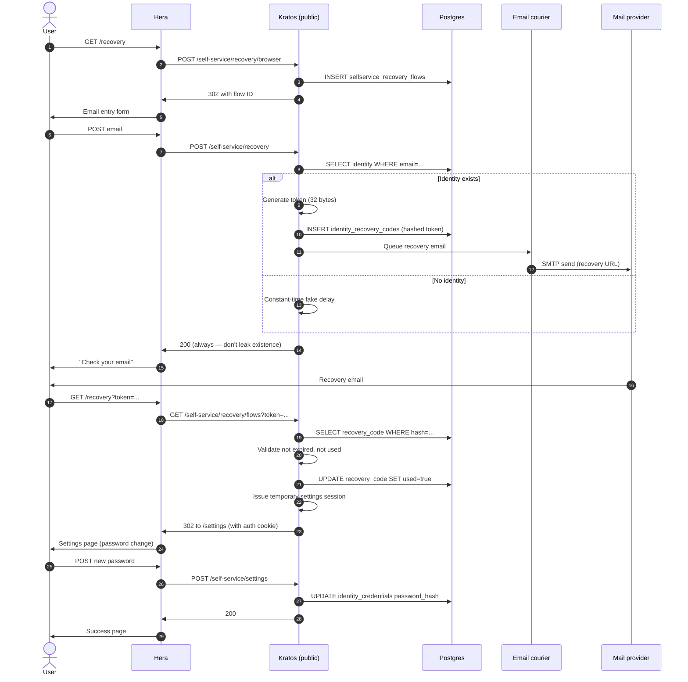

## Sequence



## Notes per step

### Constant-time fake delay

Step 10 (alt branch): if no identity matches the email, Kratos still pauses for ~hashing-time before returning. Prevents timing-based enumeration.

Confirm in Kratos logs — successful and failed recovery requests should have similar response times (within 50ms).

### Hashed token

Step 8: the token stored in DB is `HMAC-SHA256(secret, raw_token)`. The raw token is in the URL the user receives. If DB leaks, attacker can't construct valid URLs.

The HMAC secret is in `kratos.yml` as `secrets.cipher`.

### Single-use enforcement

Step 18: the row's `used` column is set true. Subsequent requests with the same token fail at step 17:

```
{ "error": "code_already_used" }
```

### Temporary settings session

Step 19: Kratos issues a session marked "privileged" (`aal2` for settings, with elevated session metadata) that's only valid for the settings flow. Cookie expires in 10 minutes.

User can change password within this window. After they navigate away or 10 min passes, they need to re-authenticate normally.

### Generic 200 response

Step 11: Kratos returns 200 OK whether or not the email exists. This prevents:
- User enumeration (knowing which emails are registered).
- Phishing (attacker iterating to find valid emails).

The downside: if the user mistypes their email, they don't get a "no such user" message — they just don't get the email. UX trade-off.

## Configuration

```yaml
# kratos.yml
selfservice:
  flows:
    recovery:
      enabled: true
      lifespan: 1h
      use: code  # vs. "link" — link uses tokens in URLs
      notify_unknown_recipients: false  # don't email if no account
```

The default `use: code` sends a 6-digit code the user enters; `use: link` sends a clickable URL.

## Brute force defense

Recovery tokens are 32 bytes — 2^256 entropy. Brute-forcing is infeasible.

For codes (6 digits = 1 million combinations), Kratos enforces 5 attempts before invalidating the flow. Worth setting CAPTCHA after 3 failures.

## Edge cases

### Multiple identities with same email

Shouldn't happen (DB unique constraint), but if traits.email isn't unique-constrained, Kratos picks the first match. Make sure your schema declares email unique.

### User no longer has access to email

Recovery via secondary channel (SMS, recovery codes, support escalation). See [Cookbook — Multi-factor recovery](/docs/cookbook/multi-factor-recovery).

### Recovery token leaked (shoulder-surfed, screenshot)

The token is short-lived (1h) and single-use. After the user completes recovery, the token is invalidated. Window of risk is small.

## See also

- [Identity — Recovery flow](/docs/identity/recovery-flow)
- [Cookbook — Multi-factor recovery](/docs/cookbook/multi-factor-recovery)
- [Cookbook — Notification templates](/docs/cookbook/notification-templates)
- [Reference — Diagrams — Recovery HMAC](/docs/reference/diagrams/seq-recovery-hmac)
