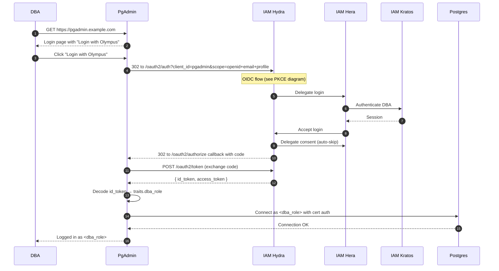

## Role mapping

The Kratos identity's `dba_role` trait (e.g. `olympus_readonly`, `olympus_app_admin`) becomes the Postgres role pgAdmin connects as. See [Security, pgAdmin DBA accounts](/docs/security/infrastructure/pgadmin-dba-accounts) and [ADR 0016](/docs/adrs/0016-pgadmin-dba-role-mapping).

## Offboarding

Deactivating the IAM identity → next pgAdmin login fails → DBA can't connect. See [Operate, pgAdmin DBA offboarding](/docs/operate/administration/pgadmin-dba-offboarding).

## Where to learn more

- [Security, pgAdmin SSO](/docs/security/infrastructure/pgadmin-sso)
- [Security, pgAdmin DBA accounts](/docs/security/infrastructure/pgadmin-dba-accounts)
- [ADR 0016, pgAdmin DBA role mapping](/docs/adrs/0016-pgadmin-dba-role-mapping)
