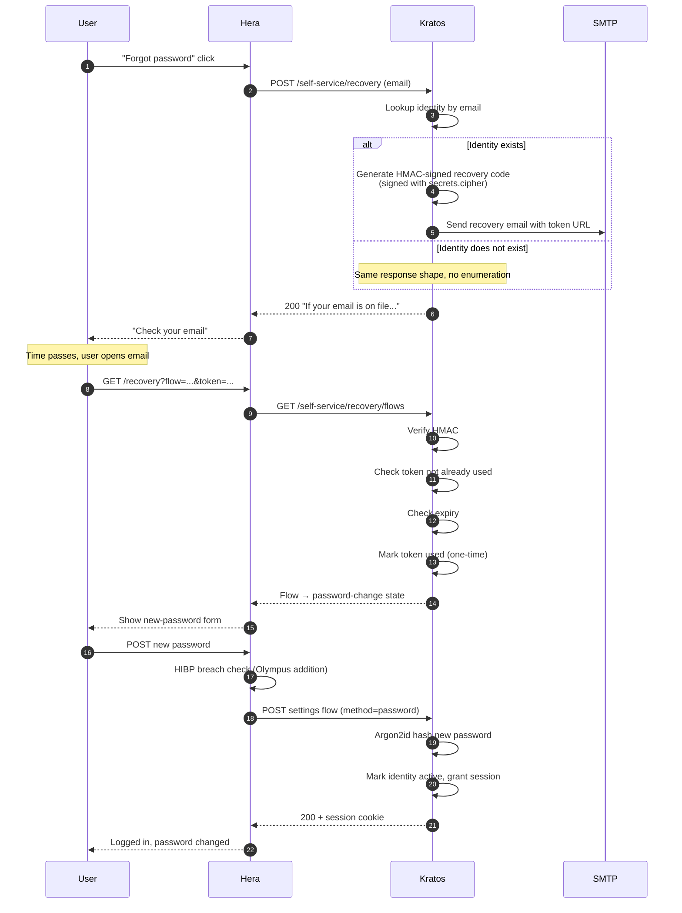

## Why HMAC, not random DB token

Stateless validation, no DB lookup per token validate; HMAC verifies cryptographically. See [ADR 0017](/docs/adrs/0017-recovery-hmac-token).

## Single-use enforcement

Even though the HMAC is stateless, single-use IS stateful, Kratos records used tokens in the recovery flow's state. Replay attack returns "token already used."

## Where to learn more

- [Identity, Flow recovery](/docs/identity/flow-recovery)
- [Security, Breached password](/docs/security/identity-protection/breached-password)
- [ADR 0017, Recovery HMAC token](/docs/adrs/0017-recovery-hmac-token)
