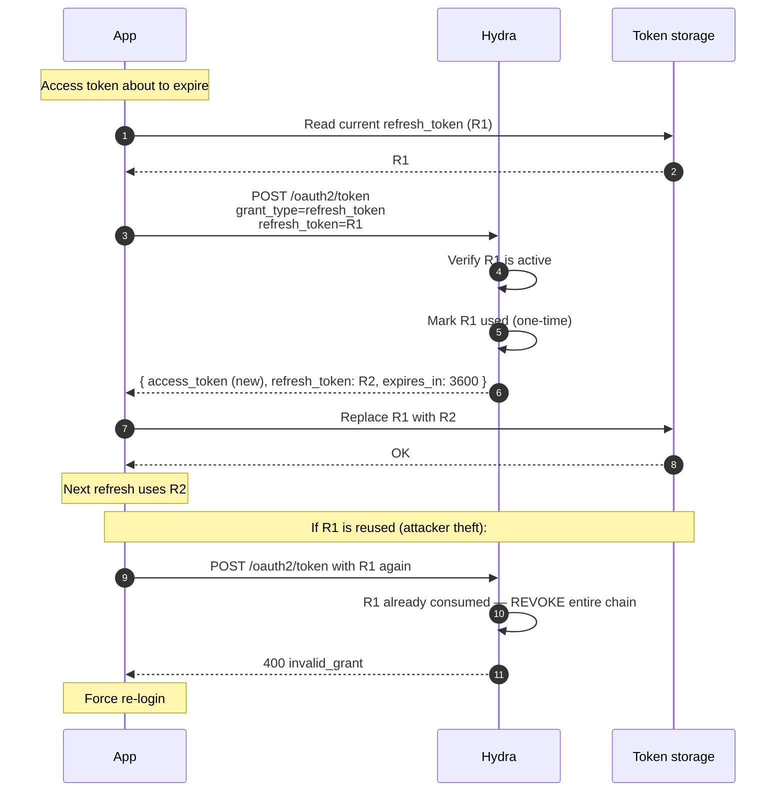

## Properties

- **Refresh token rotation.** Hydra issues a new refresh on every refresh; old one dies.
- **Reuse detection.** Hydra treats reuse of a consumed refresh token as evidence of theft; revokes the entire chain.
- **30-day default lifetime.** Configurable. The *family* of refreshes lives 30 days from initial issuance.

## Where to learn more

- [Integrate — Refresh tokens](/docs/integrate/oauth2-refresh-tokens)
- [Reference — OAuth2 grant: refresh-token](/docs/reference/grants/refresh-token)
