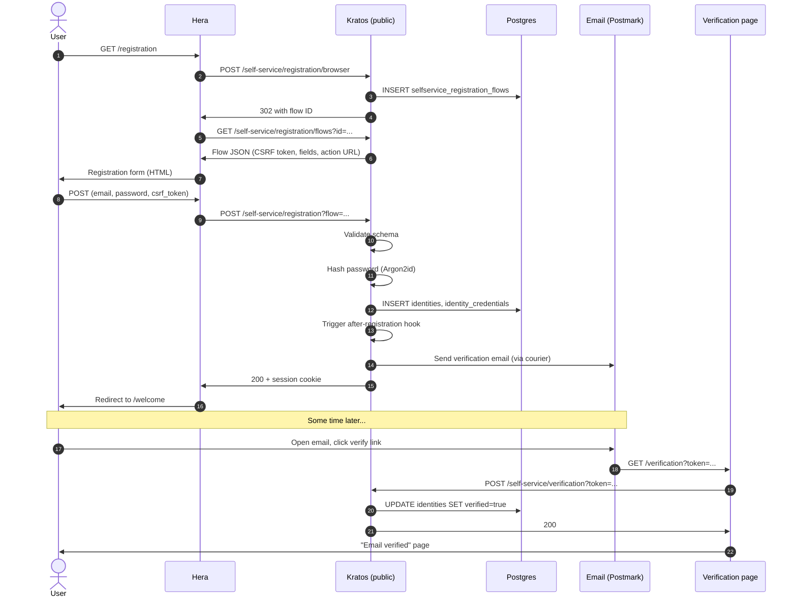

The complete flow when a user signs up with email + password, then verifies their email.

## Sequence



## What's happening at each step

| Step | What | Why |
|---|---|---|
| 1 | User loads `/registration` | Browser navigation |
| 2 | Hera starts flow | Kratos's browser flow API |
| 3 | Flow record created in DB | Trackable, expires after 1h |
| 4-5 | Flow ID issued, fetched | Stateless from Hera's view |
| 6 | Form rendered | With CSRF and field definitions |
| 7-8 | Submit goes to Kratos | Hera proxies; doesn't validate |
| 9 | Schema validation | Email format, password strength, etc. |
| 10 | Password hashed | Argon2id (m=64MB, p=2, t=2) |
| 11 | Identity row written | UUID, encrypted traits |
| 12 | Post-registration hook | If configured: pre-fill role, allowlist check, etc. |
| 13 | Verification email queued | Via courier — separate process delivers |
| 14 | Session created | Cookie set on response |
| 15 | Redirect to app | Logged in immediately (Kratos default) |
| 16-19 | User clicks email later | Async, may be hours |
| 20 | Verification updates DB | identity.verifiable_addresses.verified = true |
| 21 | Success page | Done |

## Key design decisions

### Logged in before verifying

By default, Olympus logs the user in immediately. The user can use the app right away. Email verification is "soft" — required for some flows (recovery) but not for general use.

Alternative: enforce verified-before-login. Configure:

```yaml
selfservice:
  flows:
    registration:
      after:
        password:
          hooks:
            - hook: require_verified_address
```

Adds `verifiable_addresses[].verified = true` as a session prerequisite.

### Hashed token in DB

The verification email contains a token. Kratos hashes it and stores only the hash. Even if DB is leaked, attacker can't use stored tokens.

### Email courier is asynchronous

Kratos doesn't block registration on email send. If Postmark is slow, the user still gets logged in. The email is sent eventually by the courier worker.

If courier fails persistently, you accumulate undelivered emails. Monitor courier health.

## Edge cases

### Duplicate email

Step 9 catches via DB unique constraint:

```json
{ "error": "registration_failed", "details": "identity with the same identifier already exists" }
```

### Weak password

Step 9 returns:

```json
{ "error": "validation_failed", "details": "password too weak" }
```

User sees inline error.

### Pre-registration hook rejects

Custom hook (e.g., domain allowlist) returns `reject: true`. Step 12 errors out:

```json
{ "error": "domain_not_allowed" }
```

Identity row never created. User sees error.

### Email delivery fails

Courier marks the email failed; retries up to 5 times with backoff. User may not see the verification email. They can request resend.

## See also

- [Identity — Registration flow](/docs/identity/registration-flow)
- [Identity — Verification flow](/docs/identity/verification-flow)
- [Cookbook — Email-domain allowlist](/docs/cookbook/email-domain-allowlist)
- [Cookbook — Invitation-based signup](/docs/cookbook/invitation-based-signup)
