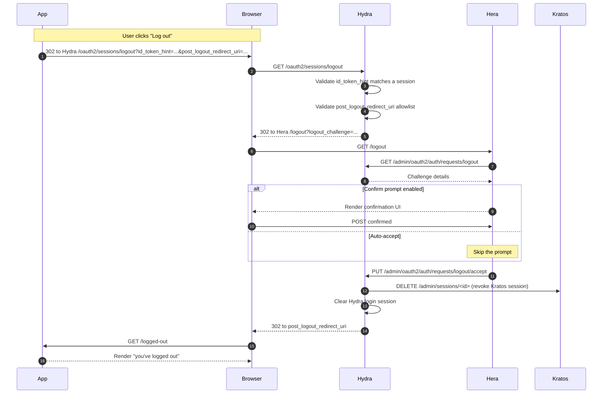

## What's revoked

- **Kratos session** (browser cookie at the CIAM/IAM domain).
- **Hydra login session** for the OAuth2 client.

## What's NOT revoked (unless you explicitly revoke)

- **Active access tokens** issued previously. They keep working until expiry.
- **Refresh tokens.** Call `/oauth2/revoke` separately if needed.

## Where to learn more

- [Integrate — RP-initiated logout](/docs/integrate/logout-rp-initiated)
- [Reference — Hydra accept logout request](/docs/reference/api/hydra/oauth2/acceptoauth2logoutrequest)
