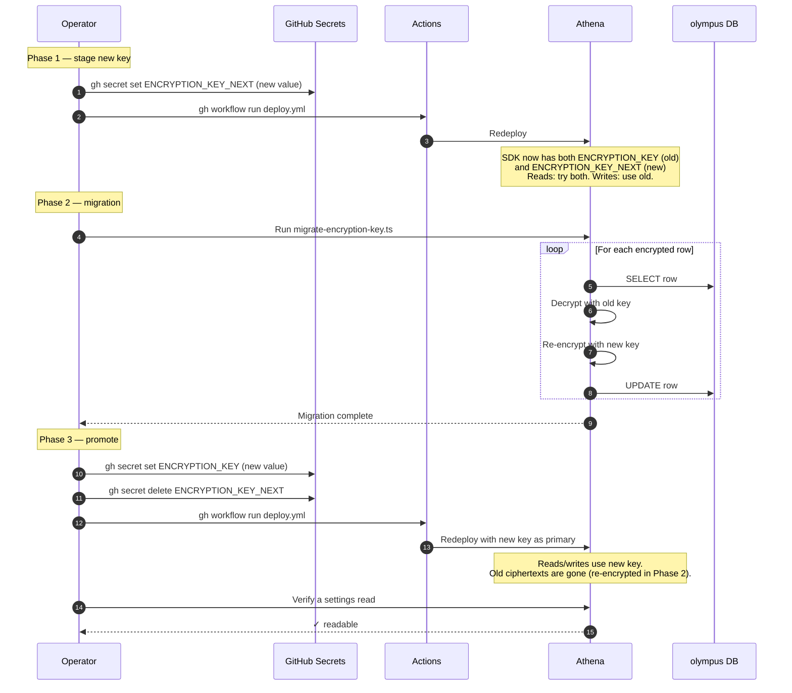

## What can go wrong

| Issue | Mitigation |
|---|---|
| Migration interrupted | Re-run — idempotent |
| Promote before migration | Roll back ENCRYPTION_KEY to old, re-run migration |
| Lost old key mid-rotation | Restore from backup before rotation start |

## Where to learn more

- [Operate — Encryption key rotation](/docs/operate/encryption-key-rotation)
- [Cookbook — Rotate encryption key](/docs/cookbook/rotate-encryption-key)
- [Security — Encryption at rest](/docs/security/encryption-at-rest)
