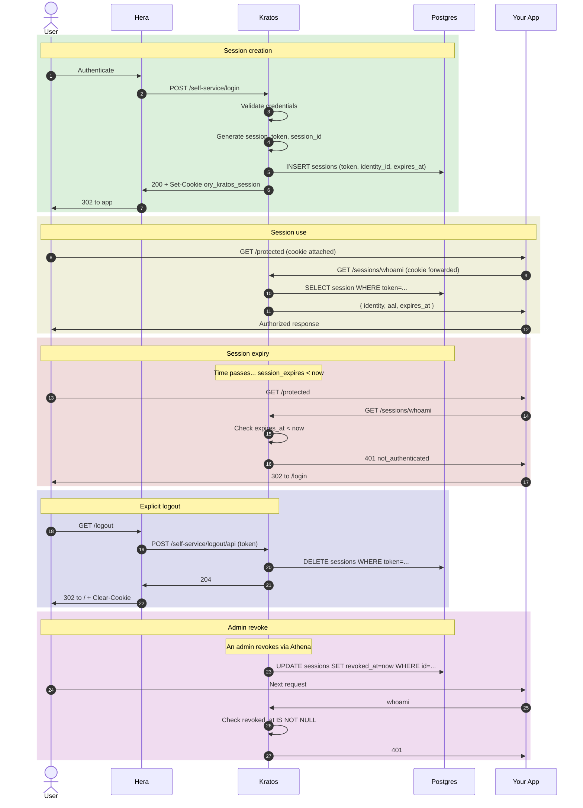

## Sequence



## Session lifecycle states

| State | DB columns | Whoami returns |
|---|---|---|
| Active | `revoked_at IS NULL` AND `expires_at > now` | 200 + identity |
| Expired | `expires_at < now` | 401 |
| Revoked | `revoked_at IS NOT NULL` | 401 |
| Refreshed | Same row, `expires_at` extended | 200 (new lifespan) |

## Refresh / extension

Default Kratos config: `lifespan: 24h`. Each call to `whoami` does NOT extend by default, the user must re-authenticate after 24h.

For sliding expiration (extend on activity):

```yaml
# kratos.yml
session:
  lifespan: 24h
  earliest_possible_extend: 1h  # extend if remaining < this
```

`whoami` will extend if the session has less than 1h remaining. Useful for "stay logged in while active" UX.

## AAL (Authenticator Assurance Level)

The session carries an AAL:
- `aal1`: password OR social OR magic link.
- `aal2`: aal1 + a second factor (TOTP / WebAuthn / SMS).

Set when the session is created. Can be elevated mid-session:

```ts
// Step-up to aal2 (e.g., for sensitive endpoint)
fetch("/self-service/settings", { credentials: "include" });
// Returns 401 if current aal is below requirement, with `aal_request_for: "aal2"`
// Client redirects to MFA challenge.
```

## Cookie attributes

```
Set-Cookie: ory_kratos_session=value;
  Path=/;
  HttpOnly;
  Secure;
  SameSite=Lax;
  Max-Age=86400
```

- `HttpOnly`: not accessible from JavaScript (XSS protection).
- `Secure`: HTTPS only.
- `SameSite=Lax`: not sent on cross-site POST (CSRF protection).
- `Max-Age`: matches session lifespan.

## Multi-device

The user can have many concurrent sessions. Each device gets its own session row. Logging out on one device doesn't affect others (unless you revoke all).

```bash
# List sessions
kratos sessions list --identity <uuid>

# Revoke all
kratos sessions revoke --identity <uuid> --all
```

Useful for "log out everywhere" UI.

## Cleanup

Expired/revoked sessions linger in DB. Periodic janitor:

```bash
podman exec ciam-kratos kratos janitor --config /etc/config/kratos.yml --keep-last 168h
```

Daily cron. Otherwise the sessions table grows indefinitely.

## See also

- [Identity, Sessions](/docs/identity/sessions)
- [Security, Session cookies](/docs/security/identity-protection/session-cookies)
- [Cookbook, Enforce step-up auth](/docs/cookbook/mfa/enforce-step-up-auth)
- [Cookbook, Rotate session signing key](/docs/cookbook/secrets-encryption/rotate-session-signing-key)
