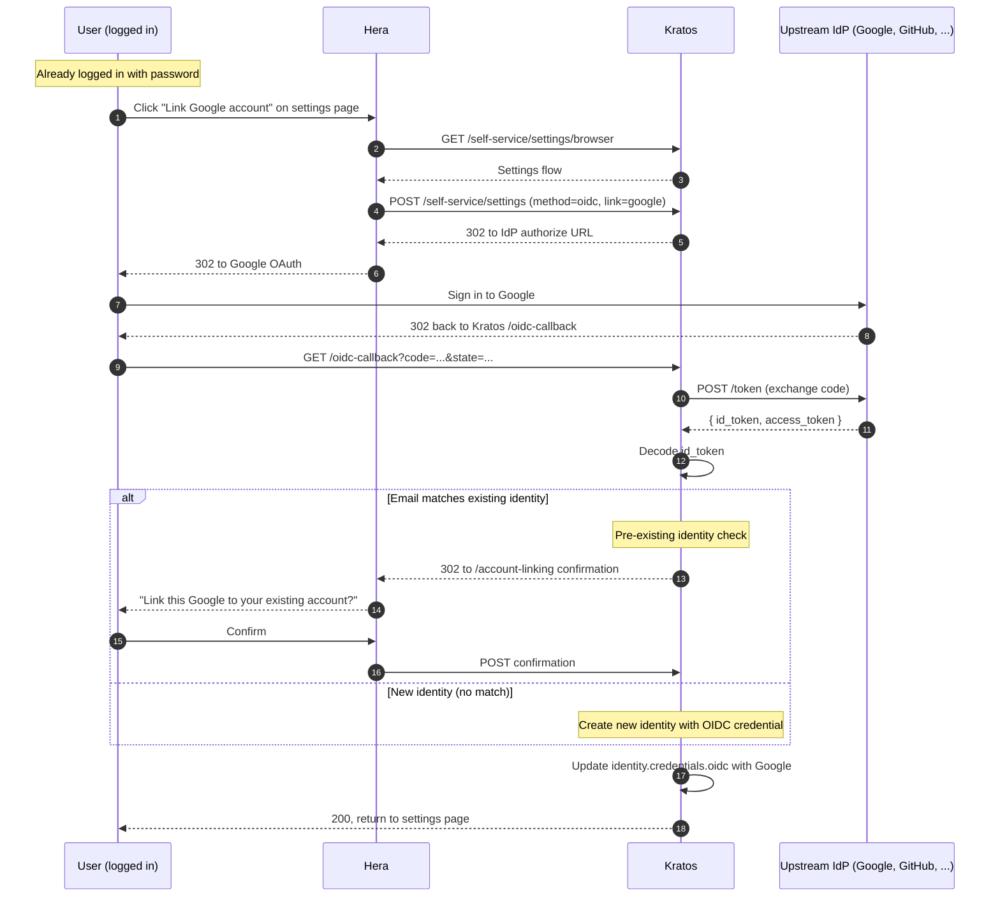

## Critical security check

If the OIDC `email` matches an existing identity's verified email, **do not auto-link**. The confirmation step prevents pre-linking attacks.

See [Identity, Account linking](/docs/identity/account-linking) for the full security rationale.

## Where to learn more

- [Identity, Account linking](/docs/identity/account-linking)
- [Identity, Social login](/docs/identity/social-login)
- [Security, OIDC email_verified trust](/docs/security/identity-protection/oidc-email-verified-trust)
