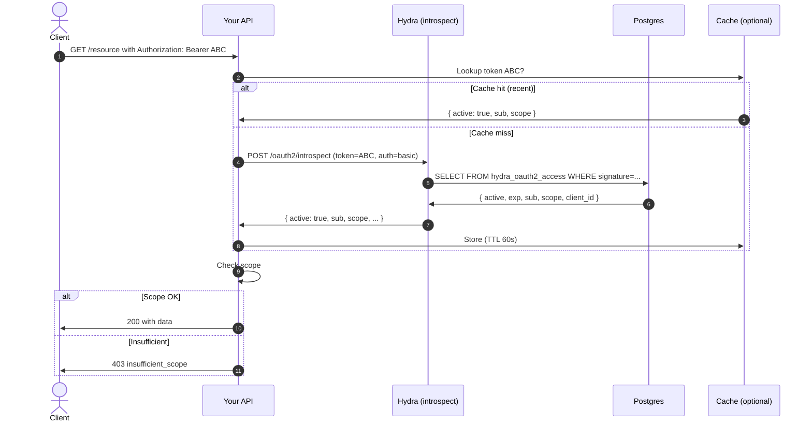

When your API receives `Authorization: Bearer ...`, it must validate the token. The OAuth2 introspection endpoint (RFC 7662) is one option.

## Sequence



## What introspection returns

```json
{
  "active": true,
  "scope": "openid api:read",
  "client_id": "my-app",
  "username": null,
  "sub": "01HZQ2X8...",
  "exp": 1715200000,
  "iat": 1715199400,
  "nbf": 1715199400,
  "aud": ["https://your-api"],
  "iss": "https://ciam.your-domain",
  "jti": "01HZQ2..."
}
```

`active: false` if token is expired, revoked, or doesn't exist.

## Authentication to introspect

The introspection endpoint requires client authentication:

```bash
curl -X POST https://ciam.your-domain/oauth2/introspect \
  -u "API_CLIENT_ID:API_CLIENT_SECRET" \
  -d "token=ABC..."
```

Why? To prevent random callers from probing token validity. Typically your API is registered as a Hydra client just for introspection.

```bash
hydra create client \
  --name "api-introspect" \
  --grant-types client_credentials \
  --token-endpoint-auth-method client_secret_basic \
  --scope ""
```

## Caching trade-offs

Caching introspection results reduces load on Hydra significantly. But it delays revocation:

```
T+0:  user revokes token
T+5s: API caches `{active: true}` (still valid in cache)
T+60s: cache expires, next call hits Hydra, returns `{active: false}`
```

For sensitive APIs, set TTL low (10s) or skip cache.

## Alternative: local JWT validation

If your access tokens are JWTs (Hydra's `oauth2.access_token_strategy: jwt`), you can validate locally without an introspect call:

```ts
import { createRemoteJWKSet, jwtVerify } from "jose";
const jwks = createRemoteJWKSet(new URL("https://ciam/.well-known/jwks.json"));
const { payload } = await jwtVerify(token, jwks, { issuer: "https://ciam/" });
// payload.sub, payload.scope, ...
```

Pros:
- No network call per request.
- Faster.

Cons:
- Token can't be revoked instantly (you'd need a revocation list).
- All claims at token-issue time, no fresh info.

For low-stakes APIs: JWT.
For high-stakes (financial, admin): introspect.

## Hybrid

JWT + revocation check:

```ts
const { payload } = await jwtVerify(token, jwks);
const revoked = await checkRevocationList(payload.jti);
if (revoked) throw new Error("token_revoked");
```

Revocation list is updated when tokens are revoked, distributed via Redis pub/sub. Worst-case latency: a few hundred ms.

## Scopes

Step 13-15: API decides if the token's scopes are sufficient. Common patterns:

```ts
// Single scope
if (!scopes.includes("orders:read")) return 403;

// Multiple required
const required = ["orders:read", "orders:list"];
if (!required.every(s => scopes.includes(s))) return 403;

// Hierarchical
const hierarchy = { "orders:*": ["orders:read", "orders:write"] };
const granted = scopes.flatMap(s => hierarchy[s] ?? [s]);
if (!granted.includes("orders:read")) return 403;
```

## Token format

Hydra opaque token (default):
```
ory_at_1lUz...HnEt
```

Hydra JWT (if configured):
```
eyJhbGciOiJSUzI1NiIs...
```

Your code shouldn't care — introspection works for both, JWT validation works only for JWTs.

## See also

- [Cookbook — Validate access token (Node)](/docs/cookbook/validate-token-node)
- [Cookbook — API rate limit by token](/docs/cookbook/api-rate-limit-by-token)
- [Reference — OAuth2 endpoints — introspect](/docs/reference/oauth2/endpoint-introspect)
- [Integrate — OAuth2 client credentials](/docs/integrate/oauth2-client-credentials)
